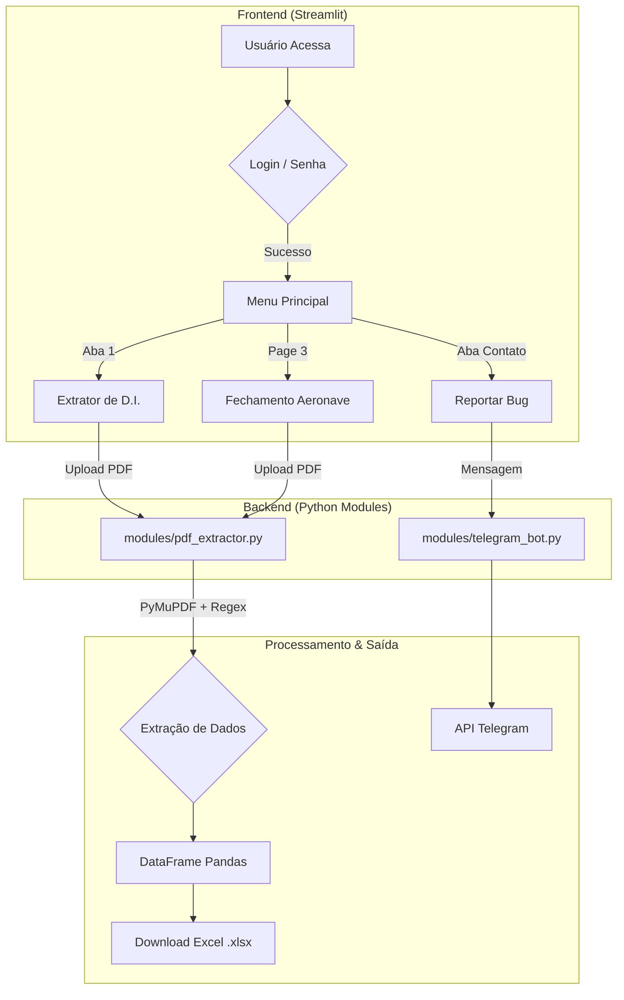

# 🚀 Extrator de Dados de PDF para Excel

[](https://extrator-pdf-aero.streamlit.app/)

## 💡 A História por Trás do Projeto

Este projeto nasceu de uma necessidade real: ajudar meu irmão em seu trabalho na área de comércio exterior e logística. Uma de suas tarefas era extrair manualmente informações de centenas de Declarações de Importação e Fechamentos de Aeronaves em PDF para consolidá-las em planilhas. Um processo repetitivo que consumia dias inteiros.

Para resolver isso, desenvolvi esta aplicação Full Stack em Python. O que antes levava horas, agora é resolvido em segundos, com extração automática via Regex, validação de dados e geração de relatórios prontos para uso.

## 🏗️ Arquitetura do Projeto

O projeto foi refatorado para seguir uma arquitetura modular e profissional, facilitando a manutenção e a escalabilidade. Abaixo está um diagrama que ilustra a estrutura da aplicação:



 

## ✨ Funcionalidades Principais
- 🔐 Controle de Acesso: Sistema de login simples via st.secrets para proteger a ferramenta.

### 📄 Múltiplos Tipos de Documentos:

-  Declaração de Importação (D.I.): Extrai número da D.I., Processo, Invoice e HAWB.

- Fechamento de Aeronave: Extrai Processo, Matrícula da Aeronave, Invoice e HAWB.

- regex 🧠 Extração Inteligente: Uso de expressões regulares avançadas para localizar dados mesmo em layouts variados.

### 🐞 Reporte de Bugs: 
- Integração direta com Telegram para envio de logs e feedback de erros em tempo real.

## 📂 Organização Modular: 
- Código separado em módulos de responsabilidade única (modules, utils, assets).

```text
extrator-pdf-streamlit/
├── .streamlit/          # Configurações locais (secrets.toml)
├── assets/              # Imagens, logos e arquivos estáticos (gifs)
├── components/          # Componentes visuais (Abas do menu principal)
│   ├── __init__.py
│   ├── tab_contato.py
│   ├── tab_instrucoes.py
│   └── tab_processamento.py
├── data/                # Dados do projeto
│   └── samples/         # PDFs de exemplo (anonimizados)
├── modules/             # Lógica de negócio (Core do sistema)
│   ├── __init__.py
│   ├── pdf_extractor.py # Motor de extração (PyMuPDF + Regex + Caching)
│   └── telegram_bot.py  # Integração com API do Telegram
├── pages/               # Páginas extras do Streamlit
│   └── 3_fechamento_aeronave.py
├── tests/               # Testes automatizados (Quality Assurance)
│   ├── __init__.py
│   └── test_regex.py    # Testes unitários das expressões regulares
├── utils/               # Ferramentas auxiliares
│   ├── __init__.py
│   └── anonimizar_pdfs.py
├── .gitignore           # Arquivos ignorados pelo Git
├── app.py               # Arquivo principal (Gerenciador da aplicação)
└── requirements.txt     # Lista de bibliotecas e versões
```

## ⚙️ Tecnologias Utilizadas
- Python 3.10+

- Streamlit: Interface web interativa.

- PyMuPDF (fitz): Leitura de alta performance de PDFs.

- Pandas: Manipulação e estruturação de dados.

- XlsxWriter: Geração de arquivos Excel nativos.

- Requests: Comunicação com API do Telegram.

🛠️ Como Rodar Localmente
Siga os passos abaixo para rodar a aplicação na sua máquina:

Clone o repositório:

```
git clone [https://github.com/mulinco/extrator-pdf-streamlit.git](https://github.com/mulinco/extrator-pdf-streamlit.git)
cd extrator-pdf-streamlit
```

## Crie e ative um ambiente virtual:
```
python -m venv .venv
```
### Windows:

```
.\.venv\Scripts\activate
```

### Linux/Mac:
```
source .venv/bin/activate
```

### Instale as dependências:
```
pip install -r requirements.txt
``` 

**Configure os Segredos (Importante!):**
    Crie uma pasta chamada `.streamlit` na raiz e um arquivo `secrets.toml` dentro dela:

```toml
    # .streamlit/secrets.toml
    APP_PASSWORD = "sua_senha_aqui"

    [telegram]
    BOT_TOKEN = "seu_token_do_bot"
    CHAT_ID = "seu_chat_id"
```

Execute a aplicação:


```
streamlit run app.py
```
📄 Licença
Distribuído sob a licença MIT. Veja o arquivo ```LICENSE``` para mais informações.